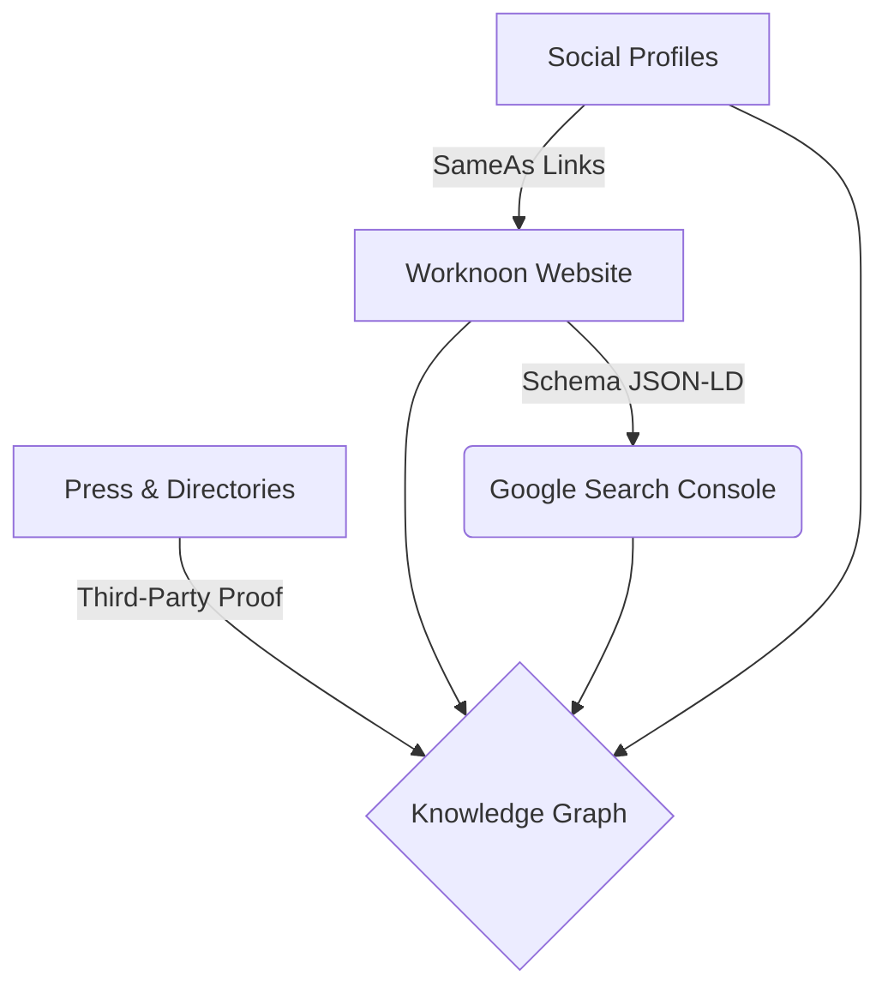

# 🧠 Knowledge Panel Strategy: Worknoon

> [!IMPORTANT]
> This document outlines the strategic roadmap for establishing **Worknoon** as a verified entity within the Google Knowledge Graph and triggering a Knowledge Panel.

---

## 1. 🏗️ Strategy Overview
Google establishes entity identity through a combination of **Consistency**, **Authority**, and **Explicitness**. This strategy focuses on aligning all digital footprints to confirm Worknoon's status as a distinct, notable entity.

### 📊 The Knowledge Graph Ecosystem


---

## 2. 🧱 Entity Foundations
The first phase focuses on cleaning and aligning core identity signals across the web.

| Phase | Action Item | Priority | Expected Impact |
| :--- | :--- | :--- | :--- |
| **01** | Claim/Verify Profiles (LinkedIn, Twitter, GMB) | 🔥 High | Establishes anchor points |
| **02** | Align Naming: "Worknoon" (Strictly) | 🔥 High | Eliminates entity ambiguity |
| **03** | Standardize Description: "Flexible hybrid spaces" | ⚡ Med | Strengthens semantic association |
| **04** | Metadata Cleanup: Remove duplicates/fake profiles | ⚡ Med | Prevents signal dilution |

---

## 3. 🛠️ Technical Implementation (Schema)
Explicitly telling Google who Worknoon is via **Organization Schema**. 

> [!TIP]
> Place this code snippet in the `<head>` section of the homepage and the `/about` page for maximum visibility.

```json
{
  "@context": "https://schema.org",
  "@type": "Organization",
  "name": "Worknoon",
  "url": "https://worknoon.com",
  "logo": "https://worknoon.com/logo.png",
  "description": "Platform for flexible hybrid spaces in 100+ cities.",
  "sameAs": [
    "https://www.linkedin.com/company/worknoon",
    "https://twitter.com/worknoon"
  ]
}
```

---

## 4. 🎨 Brand Consistency Signals
Consistent visual and textual cues help Google's crawlers verify entity authenticity.

*   **Logo Consistency**: Use identical high-res files on all top-tier profiles.
*   **Micro-Signals**:
    *   **Email**: Use `hello@worknoon.com` (Avoid generic provider emails).
    *   **Favicon**: Standardize for both Chrome tab and SERP appearance.
    *   **Tagline**: Maintain exact phrasing: *"Flexible Hybrid Spaces"*.

---

## 5. 📰 Authority & Reputation Tiering
External validation is the "weight" behind the Knowledge Panel.

### 🥇 Primary Authority (Direct Knowledge Graph Input)
*   **Crunchbase**: Essential for startups/corporate entities.
*   **LinkedIn**: The industry standard for organizational verification.
*   **Google Business Profile**: Crucial for local and physical location signals.

### 🥈 Secondary Authority (Reputation)
*   **Directory Listings**: Coworker.com, Upflex, Spacebase.
*   **User Validation**: Trustpilot or G2 reviews to build sentiment scores.
*   **Niche Press**: TechCrunch, BetaList, or industry-specific blogs.

---

## 6. 📄 Optimized "About" Page Architecture
The `/about` page is the primary source of truth for Google's Knowledge Graph extracts.

| Element | Specification | Rationale |
| :--- | :--- | :--- |
| **H1 Header** | `About Worknoon` | Explicit semantic header |
| **Intro Bio** | First 160 characters contain target keywords | Snippet optimization |
| **Team Section** | Names + LinkedIn URLs | Team-to-Organization mapping |
| **Historical Data** | Founding date & Milestone timeline | Temporal signal stability |
| **Core Stats** | Cities served, Space count | Notability metrics |

